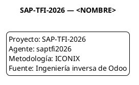

# Aplicación de ICONIX a Odoo

## Contexto específico

Este proyecto documenta la **ingeniería inversa** de los módulos nativos de Odoo 19.0 (Ventas, Facturación, Entregas, Inventario). Odoo es un ERP open-source complejo, con +30,000 archivos Python y más de 100 modelos en estos 4 módulos solamente.

Aplicar ICONIX directamente sobre Odoo presenta desafíos únicos:

1. **Herencia múltiple**: los modelos heredan de muchos mixins (`mail.thread`, `mail.activity.mixin`, `portal.mixin`, etc.). El "modelo de clases técnico" debe reflejar esto.
2. **Campos computados**: muchos campos no están en la BD, se calculan dinámicamente (`_compute_*`).
3. **Métodos `onchange`**: disparan lógica al cambiar un campo en el form.
4. **Acciones (`ir.actions.act_window`)**: definen vistas, wizards, botones.
5. **Multi-empresa y multi-moneda**: las reglas de registro y campos monetarios son contextuales.
6. **Estado del modelo de dominio vs modelo técnico**:，我们必须separar los conceptos del negocio (Cliente, Producto, Pedido) de las clases técnicas (`res.partner`, `product.product`, `sale.order`).

## Adaptaciones realizadas

### 1. Separación modelo conceptual vs técnico

**Decisión clave**: mantener **dos diagramas de clases separados**.

- **Modelo conceptual** (`d_cla_con_gen_001_modelo_dominio.puml`): solo conceptos del negocio. Cliente, Producto, Presupuesto, Pedido, Factura, Pago. Atributos en lenguaje natural, no campos.
- **Modelo técnico** (`d_cla_int_001_integracion_ven_stock_cont.puml`): las clases REALES de Odoo con sus `_name`, `_inherit`, campos y métodos. Aquí sí aparecen `res.partner`, `sale.order`, `account.move`, etc.

### 2. Uso de códigos de evidencia EV-*

Cada afirmación tiene un código que apunta a su fuente:

| Código | Significado | Verificable contra |
|--------|-------------|---------------------|
| `EV-COD-NNN` | Código fuente | Ruta de archivo + línea exacta |
| `EV-XML-NNN` | Vista o dato XML | Ruta XML + elemento |
| `EV-UI-NNN` | Comportamiento observado | Manual o screenshot |
| `EV-DB-NNN` | Estructura de BD | Tabla y columnas |
| `EV-DOC-NNN` | Documentación oficial | URL + sección |
| `EV-TEST-NNN` | Prueba automatizada | Ruta del test |
| `EV-INF-NNN` | Inferencia pendiente | (no verificado) |

Esto permite que un revisor pueda **verificar** cada afirmación abriendo el código en la línea exacta.

### 3. Foco en el flujo principal

La primera iteración se enfoca en **un solo flujo** end-to-end:

```
Crear presupuesto → Confirmar pedido → Reservar productos →
Validar entrega → Crear factura → Publicar factura → Registrar pago
```

Es el flujo más importante del circuito comercial. Una vez documentado, se pueden agregar CU adicionales (cancelaciones, devoluciones, notas de crédito) en iteraciones siguientes.

### 4. PlantUML como formato estándar

Todos los diagramas están en **PlantUML** (texto plano, versionable). Esto permite:

- Editar los diagramas con cualquier editor.
- Generar PDFs, PNGs, SVGs automáticamente.
- Hacer diff de los cambios en git.

La cabecera estándar (en todos los .puml) es:



### 5. Reglas de naming

| Tipo | Patrón | Ejemplo |
|------|--------|---------|
| Caso de uso | `CU-{AREA}-{NNN}` | `CU-VEN-001` |
| Regla de negocio | `RN-{AREA}-{NNN}` | `RN-VEN-002` |
| Diagrama | `D-{TYPE}-{AREA}-{NNN}` | `D-ROB-VEN-004` |
| Archivo | `lowercase_with_underscores` | `cu_ven_001_crear_presupuesto.md` |
| Evidencia | `EV-{TYPE}-{NNN}` | `EV-COD-001` |

Áreas: `VEN` (Ventas), `FAC` (Facturación), `ENT` (Entregas), `INV` (Inventario), `ARQ` (Arquitectura), `DOM` (Dominio), `GEN` (General).

## Resultados de la primera iteración

- **7 CU** documentados con especificación completa (objetivo, alcance, actor, flujos, excepciones, RN, modelos Odoo, métodos, pantallas, evidencia).
- **2 diagramas de robustez** (CU-VEN-001, CU-VEN-004, CU-ENT-002, CU-FAC-001).
- **3 diagramas de secuencia** (idem).
- **1 modelo de dominio conceptual** con 12 conceptos y 9 reglas de negocio.
- **1 modelo de clases técnicas** mostrando la integración entre venta, stock y contabilidad.
- **30 EV-COD** generadas (código verificado contra código real de Odoo 19.0).
- **8 EV-INF** pendientes (reducidas desde 22 originales tras validación).

## Herramientas

- **Hermano (este agente)**: el swarm `saptfi2026` con 8 skills especializadas.
- **PlantUML**: para generar los diagramas.
- **Git**: para versionar todo.
- **OpenRouter + minimax-m3**: como modelo de lenguaje.
- **GitHub**: para publicar el repo (gate S2: push solo con OK manual de Ale).

## Próxima sección

→ [Cómo leer los CU](03_como_leer_los_cu.md) — guía paso a paso para interpretar las especificaciones.